ADXHack
=======

Pre-Reqs:
---------

-   Visual Studio Hack

-   Microsoft Edge

-   CSV Files for manual ingestion

-   Review Cost Estimator

    -   <https://dataexplorer.azure.com/AzureDataExplorerCostEstimator.html>

-   Able to Access:

    -   <https://dataexplorer.azure.com/>
	
- Install Kusto-Explorer on machine
https://docs.microsoft.com/en-us/azure/data-explorer/kusto/tools/kusto-explorer

### 1. Environment Setup – Azure Data Explorer
--------------------------------------------

1a.  Create ADX Instance

<https://docs.microsoft.com/en-us/azure/data-explorer/create-cluster-database-portal>

| 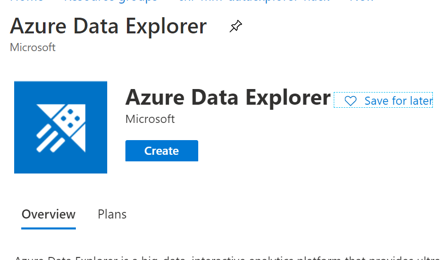 |
|------------------------------------------------------------------------------------------|

1b. Setting up basic configuration

| 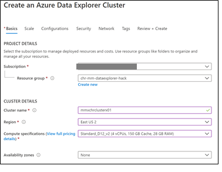 |
|------------------------------------------------------------------------------------------|

1b. Setting data explorer scale

|  |
|--------------------------------------------------------------------------------------------|

1c.  Set the streamining - lower latency on ingest

<https://docs.microsoft.com/en-us/azure/data-explorer/ingest-data-streaming>

| 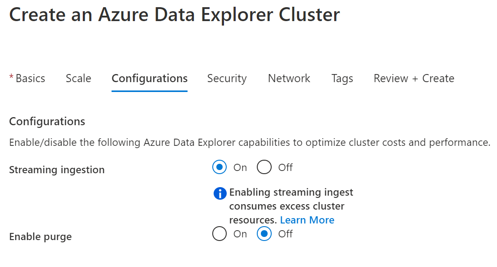 |
|------------------------------------------------------------------------------------------|


1d. Security Configuration

| 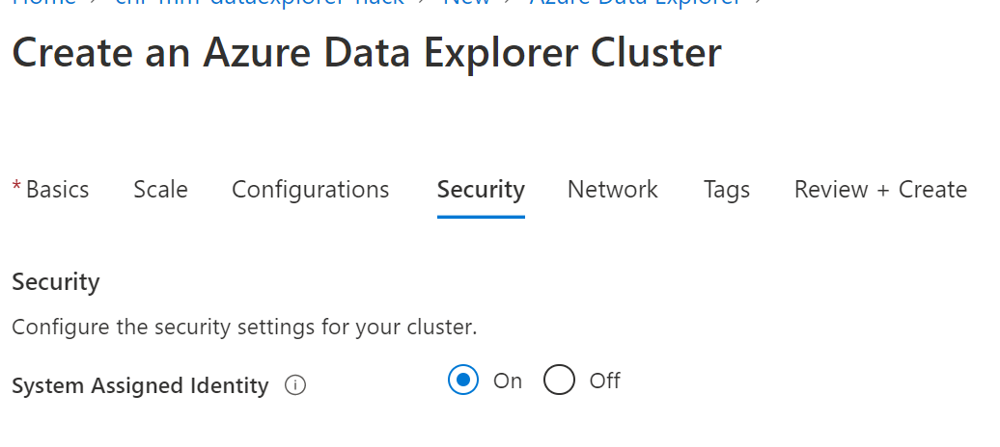 |
|------------------------------------------------------------------------------------------|


Review + Create – This will take some time.

### 2. Environment Setup – Create Event Hub
------------------------------------
2a. Click on the create button
| 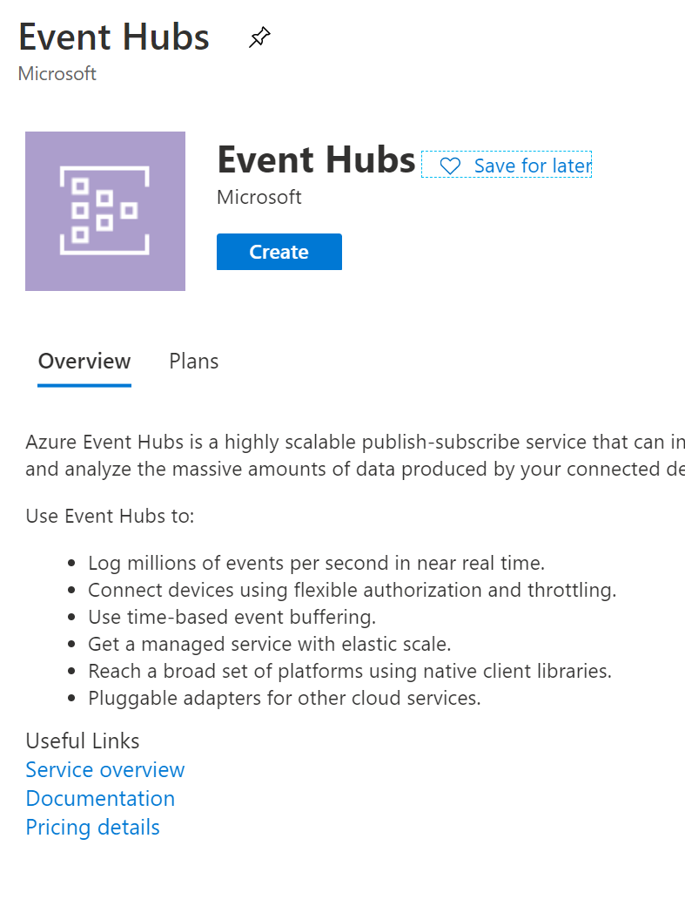 |
|------------------------------------------------------------------------------------------|

2b.  In basics select your sub, resource group, namespace, location, pricing tier

| 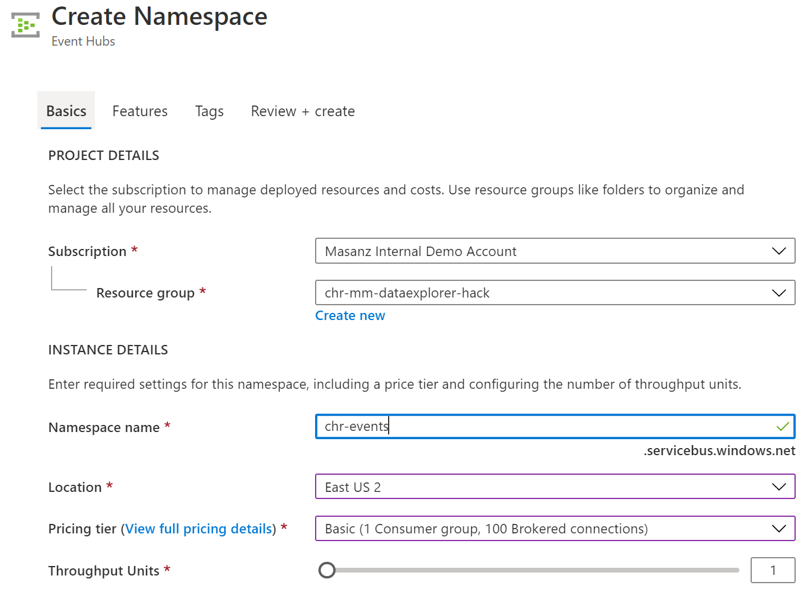 |

2c.  We need to create an event hub
| 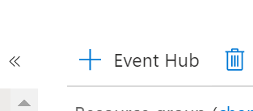 |

2d.  Give Event ub a name
| 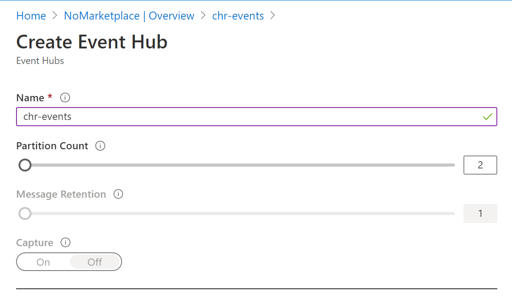 |

“Create”

Over on the left side tabl click on teh event hubs and we should see it.

|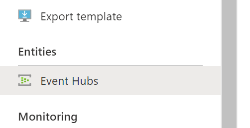 |
|------------------------------------------------------------------------------------------|

### 3. Create ADX Database: chradxdb
-----------------------------

3a.  Clicking on our instance we should be able to hit the **+ Add database** or the **Create Database* button

| 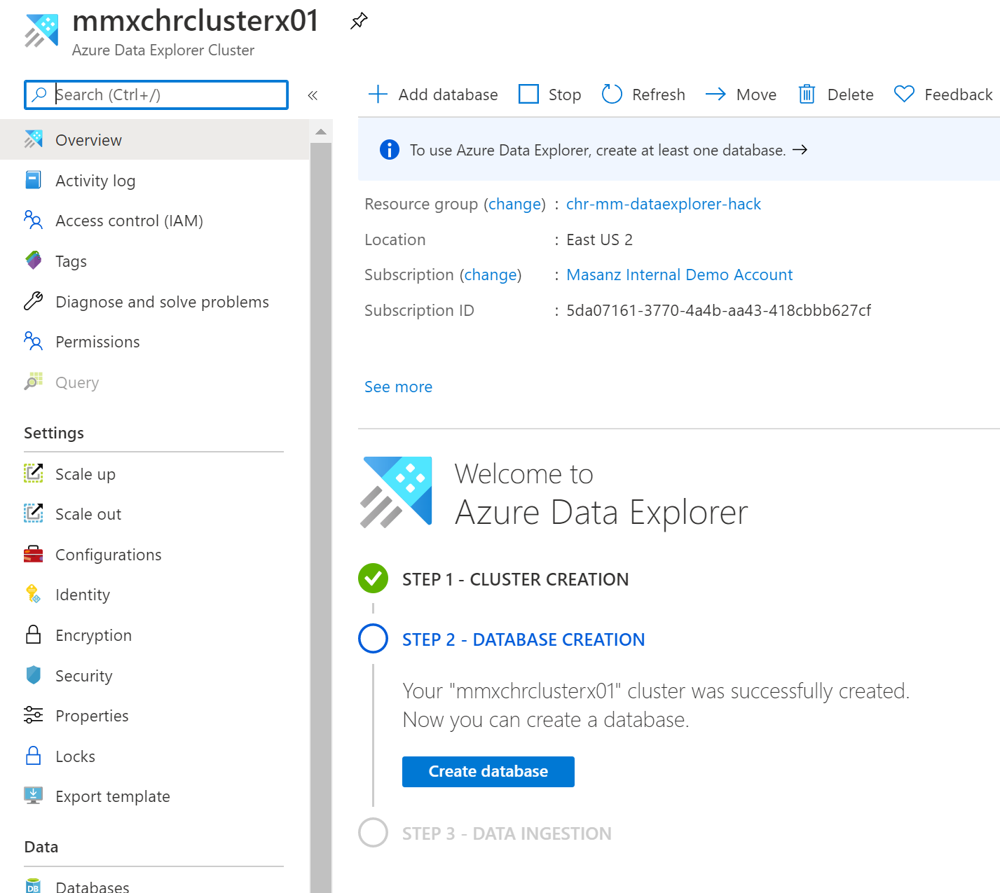 |
|------------------------------------------------------------------------------------------|

3b.  Provide: database name and retention period - this is for blob storage and cache

<https://docs.microsoft.com/en-us/azure/data-explorer/kusto/management/cachepolicy>

Azure Data Explorer cache provides a granular cache policy that customers can use to differentiate between: hot data cache and cold data cache. Azure Data Explorer cache attempts to keep all data that falls into the hot data cache category, in local SSD (or RAM), up to the defined size of the hot data cache. The remaining local SSD space will be used to hold data that isn't categorized as hot. One useful implication of this design is that queries that load lots of cold data from reliable storage won't evict data from the hot data cache. As a result, there won't be a major impact on queries involving the data in the hot data cache.

| 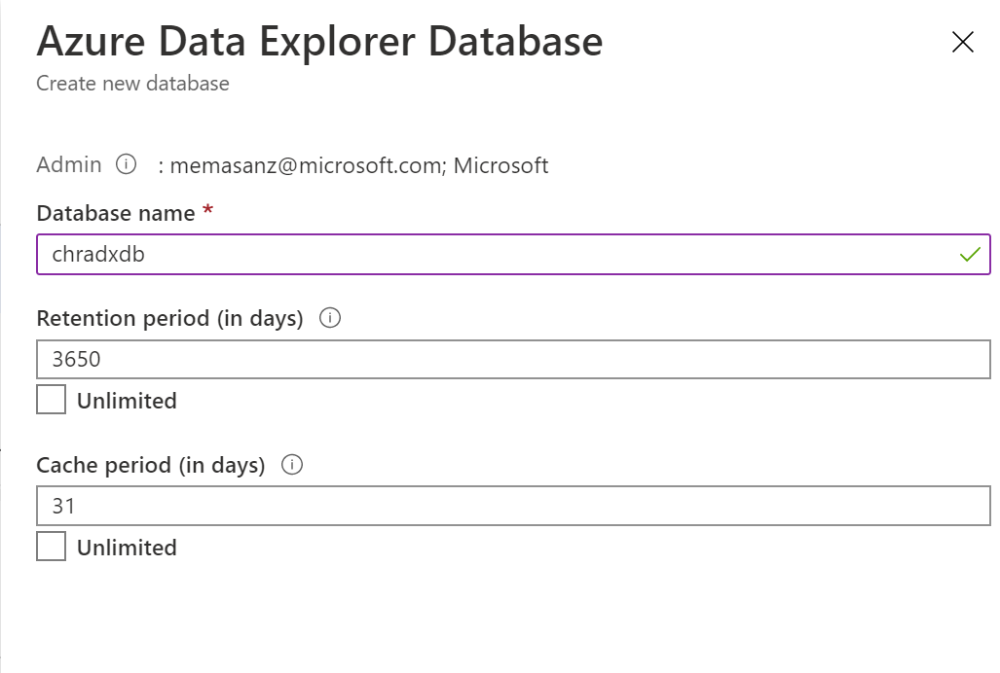 |
|------------------------------------------------------------------------------------------|

### 4.  Query to Create Table

```SQL
.create table  TransactionEvents ( processed: datetime,  transactionType: string,  direction: string,  partner:string,  serverClusterMainNode:string,  errorResolutionType:int ,  purpose: string,  loadNum:string,  shipmentNum: string,  proNum: string )
```

| 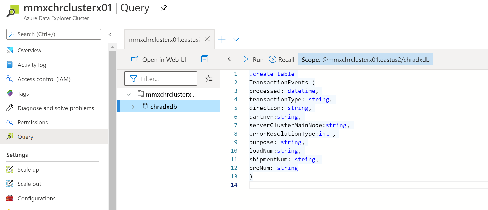|
|------------------------------------------------------------------------------------------|

### 5. Query Create Mapping

```SQL
.create table TransactionEvents ingestion json mapping 'TransactionEventsMapping' '[{"column":"processed", "Properties": {"Path": "\$.processed"}},{"column":"transactionType", "Properties": {"Path":"\$.transactionType"}} ,{"column":"direction", "Properties": {"Path":"\$.direction"}},{"column":"partner", "Properties": {"Path":"\$.partner"}}, {"column":"serverClusterMainNode", "Properties": {"Path":"\$.serverClusterMainNode"}}, {"column":"errorResolutionType", "Properties": {"Path":"\$.errorResolutionType"}}, {"column":"purpose", "Properties": {"Path":"\$.purpose"}}, {"column":"loadNum", "Properties": {"Path":"\$.loadNum"}}, {"column":"shipmentNum", "Properties": {"Path":"\$.shipmentNum"}}, {"column":"proNum", "Properties": {"Path":"\$.proNum"}}]'
```

### 6. Set Permissions

We need to set permissions.  On the left tab we will see permssions, we can leverage Azure AD to get userss.

| 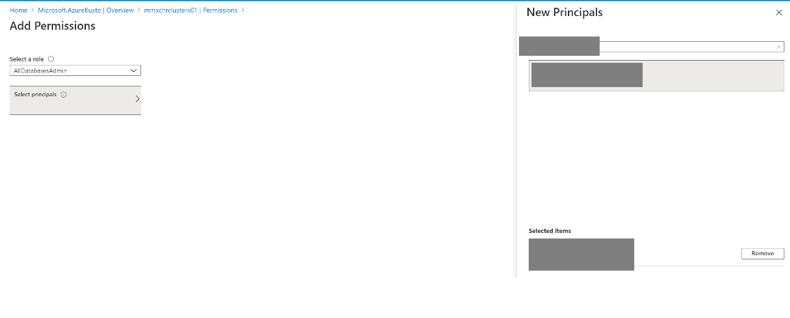 |
|------------------------------------------------------------------------------------------|


### 7. Create Connection to Event Hub

<https://docs.microsoft.com/en-us/azure/data-explorer/ingest-data-event-hub>

Click on database and select ‘Data ingestion’

| 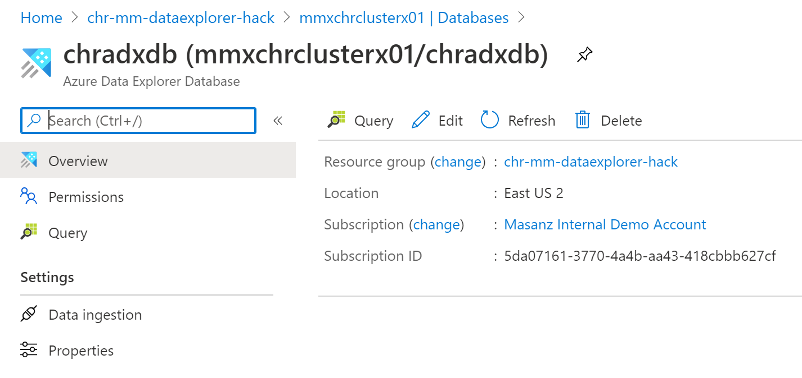 |
|------------------------------------------------------------------------------------------|


### 8. Add a new connection

| 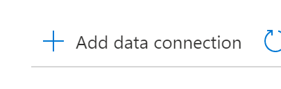 |
|------------------------------------------------------------------------------------------|
| 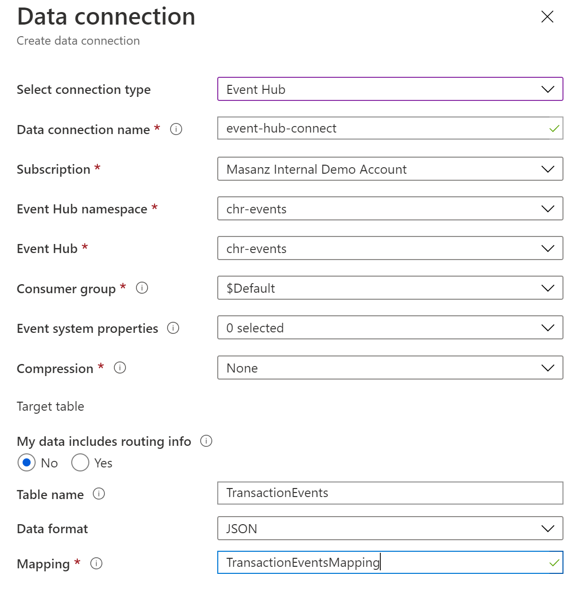 |

### 9. Setup Console Application to act as data going into Event Hub
-------------------------------------------------------------

From cloned repo open the program.cs file and lets review & set a few
properties.

| Variable to set in repo: |
|--------------------------|
| EventHubConnectionString |
| EventHubName             |
| SourceFileLocation       |


| 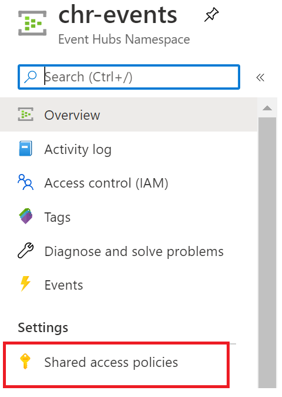 |
|------------------------------------------------------------------------------------------|

| 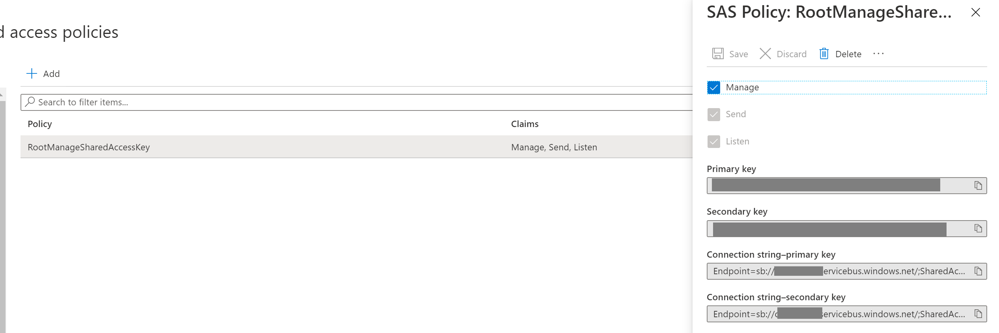 |
|------------------------------------------------------------------------------------------|


### 10. Confirm Event Hub Connection

### 11.  Check Count in KQL Query

```SQL
TransactionEvents
| count
```

### 12. Edit Mapping Import


|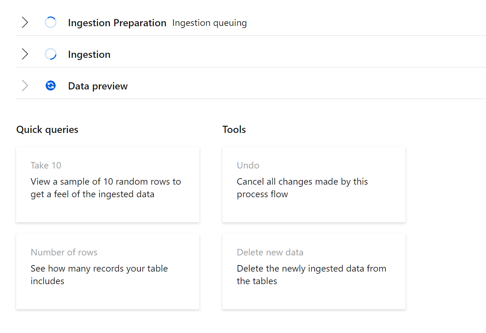 |
|------------------------------------------------------------------------------------------|

### 13.  Install Kusto.Explorer
<https://docs.microsoft.com/en-us/azure/data-explorer/kusto/tools/kusto-explorer>

Kusto Explorer will actually pick up anomolies without us doing anything

```SQL
let min_t = toscalar(TransactionEvents | summarize min(processed));
let max_t = toscalar(TransactionEvents | summarize max(processed));
let dt = 2h;
TransactionEvents
| make-series num=count() default=0 on processed in range(min_t, max_t, dt) by serverClusterMainNode
| render anomalychart with ( title='Transactions anomalies') 
```

|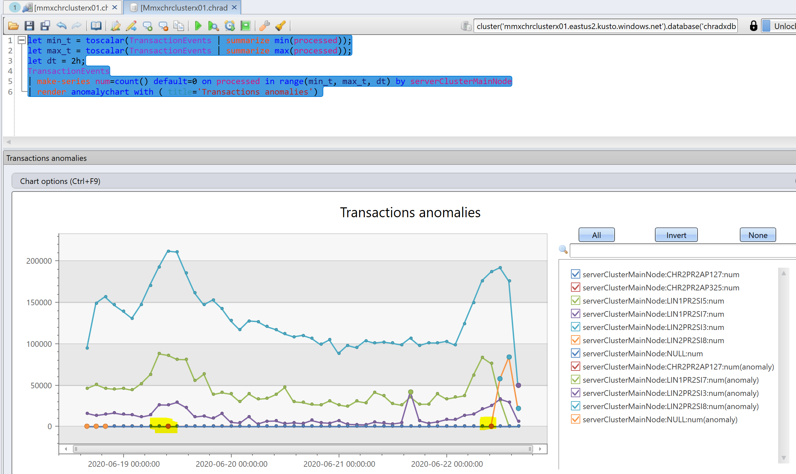|

**But let's take a step back and start going through some queries and syntax**

### 14.  In Kusto.Explorer or Edge - lets start looking at some data

```SQL
TransactionEvents
| count 
```

```SQL
TransactionEvents
| take 5
```

```SQL
TransactionEvents
| summarize num=count(), min_t=min(processed), max_t=max(processed)
```


```SQL
//sliding window metric
//https://docs.microsoft.com/en-us/azure/data-explorer/kusto/query/sliding-window-counts-plugin#examples
//count for the day, distinct partners for the day, new partners for the day
let min_t = toscalar(TransactionEvents | summarize min(processed));
let max_t = toscalar(TransactionEvents | summarize max(processed));
let window= 1d;
TransactionEvents | evaluate activity_counts_metrics(partner, processed, min_t, max_t, window)
```


```SQL
//Time Chart by transaction count
let min_t = toscalar(TransactionEvents | summarize min(processed));  
let max_t = toscalar(TransactionEvents | summarize max(processed));  
TransactionEvents
| make-series num=count() on processed from min_t to max_t step 1m
| render timechart with(title="Traffic Information, 1 minute resolution")
```

```SQL
//very basic time chart over 10 minute step
let min_t = toscalar(TransactionEvents | summarize min(processed));
let max_t = toscalar(TransactionEvents | summarize max(processed));
TransactionEvents 
| make-series transactionCount=count()
 on processed
 from min_t to max_t step 10m
 |render timechart
 with (title = "Serivce exceptions over a week, 10 minute resolution")
 ```
 
 
```SQL
//based on count and binned into 1 hour - by direction
let min_t = toscalar(TransactionEvents | summarize min(processed));
let max_t = toscalar(TransactionEvents | summarize max(processed));
TransactionEvents
| make-series NumberOfEvent=count() default=0 on processed
 //1 hour bins
 from min_t to max_t step 1h
 //partition key, seperate time series for direction
 by direction
 |render timechart 
 ```
 
 
```SQL
 //Basic Time Chart by direction
let min_t = toscalar(TransactionEvents | summarize min(processed));
let max_t = toscalar(TransactionEvents | summarize max(processed));
TransactionEvents
| make-series num=count() default=0 on processed 
in range(min_t, max_t, 1m) 
by direction
| render timechart 
```

```SQL
 //series_fir - will be used later.
 //fir = finite impulse response, moving averages, calc change detection
let min_t = toscalar(TransactionEvents | summarize min(processed));
let max_t = toscalar(TransactionEvents | summarize max(processed));
TransactionEvents
| make-series NumberOfEvent=count() default=0
 on processed
 //1 hour bins
 from min_t to max_t step 1h
 //partition key, seperate time series for direction
 by direction
 //moving average number - column to average, filter - coeffients of filter - shape of block for moving average, NormalizeResults, centered average (10, 20, 30, 40, 50) - becomes (0, 0, 10, 20, 30)
 |extend ma_num=series_fir(NumberOfEvent, repeat(1, 5), true, true)
 |render timechart 
``` 

```SQL
//Residuals by transaction type
let min_t = toscalar(TransactionEvents | summarize min(processed));
let max_t = toscalar(TransactionEvents | summarize max(processed));
TransactionEvents
| make-series num=count() default=0 on processed in range(min_t, max_t, 1m) by transactionType
//series_fir - moving averages
//so we subtract from the data the moving average to get the differences
| extend ma_num=series_fir(num, repeat(1, 5), true, true)
| extend residual_num=series_subtract(num, ma_num) //to calculate residual time series
| where transactionType == "204"   // filter on Win 10 to visualize a cleaner chart 
| render timechart
```

```SQL
//Look at moving average for a partner.
let min_t = toscalar(TransactionEvents | summarize min(processed));
let max_t = toscalar(TransactionEvents | summarize max(processed));
TransactionEvents
| make-series num=count() default=0 on processed in range(min_t, max_t, 1h) by partner
| extend ma_num=series_fir(num, repeat(1, 5), true, true)
| where partner == "MACROPOINT"
| render timechart 
```


```SQL
//Need to recall what makes this interesting.
let min_t = toscalar(TransactionEvents | summarize min(processed));  
let max_t = toscalar(TransactionEvents | summarize max(processed));  
TransactionEvents
| make-series num=count() default=0 on processed in range(min_t, max_t, 10m) by serverClusterMainNode, direction
| extend (rsquare, slope) = series_fit_line(num)
| top 2 by slope asc 
| render timechart with(title='by ServerCluster and by direction)')
```

```SQL
//Getting ready for anomoly detection
//Decomposition - take a time series and break down into components
//Seasonal
//trend
//residual - input - baseline for anomoly detection
//baseline (predicted value to be used for forecasting)
//create time series per partner.
let min_t = toscalar(TransactionEvents | summarize min(processed));
let max_t = toscalar(TransactionEvents | summarize max(processed));
let dt = 2h;
TransactionEvents
| make-series num=count() default=0 on processed in range(min_t, max_t, dt) by partner
| where partner == "MACROPOINT"
| extend (baseline, seasonal, trend, residual) = series_decompose(num, -1, 'linefit')
| render timechart 
with (title='traffic, decomposition', ysplit=panels)
```

```SQL
//will only run in kusto.Explorer
//series_decompose_anomalies
let min_t = toscalar(TransactionEvents | summarize min(processed));
let max_t = toscalar(TransactionEvents | summarize max(processed));
let dt = 2h;
TransactionEvents
| make-series num=count() default=0 on processed in range(min_t, max_t, dt) by serverClusterMainNode
| where serverClusterMainNode == 'LIN2PR2SI3'
| render anomalychart with ( title='Transactions, anomalies')
```

```SQL
//series_decompose_anomalies
let min_t = toscalar(TransactionEvents | summarize min(processed));
let max_t = toscalar(TransactionEvents | summarize max(processed));
let dt = 2h;
TransactionEvents
| make-series num=count() default=0 on processed in range(min_t, max_t, dt) by serverClusterMainNode
| extend (anomalies, score, baseline) = series_decompose_anomalies(num, 1.5, -1, 'linefit')
| render anomalychart 
with (anomalycolumns=anomalies, title='Transactions, anomalies')
```


```SQL
let min_t = toscalar(TransactionEvents | summarize min(processed));
let max_t = toscalar(TransactionEvents | summarize max(processed));
let dt = 2h;
TransactionEvents
| make-series num=count() default=0 on processed in range(min_t, max_t, dt) by serverClusterMainNode
| extend (anomalies, score, baseline) = series_decompose_anomalies(num, 1.5, -1, 'linefit')
| render anomalychart 
with (anomalycolumns=anomalies, title='Transactions, anomalies')
```

```SQL
let min_t = toscalar(TransactionEvents | summarize min(processed));
let max_t = toscalar(TransactionEvents | summarize max(processed));
TransactionEvents
| make-series num=count() default=0 on processed in range(min_t, max_t, 1m) by  direction
| where direction == 'I'   //  select a single time series for a cleaner visualization
| extend (anomalies, score, baseline) = series_decompose_anomalies(num, 9.5, -1, 'linefit')
| render anomalychart with(anomalycolumns=anomalies, title='Web app. traffic of a month, anomalies') //use "| render anomalychart with anomalycolumns=anomalies" to render the anomalies as bold points on the series charts.
```

```SQL
//
let min_t = datetime(2020-06-19 00:00:00);
let max_t = datetime(2020-06-19 02:00:00);
TransactionEvents
| make-series num=count() default=0 on processed in range(min_t, max_t, 1h) by  direction, partner
| where direction == 'I'   //  select a single time series for a cleaner visualization
| extend (anomalies, score, baseline) = series_decompose_anomalies(num, 9.0, -1, 'linefit')
```

```SQL
//fill gaps in data - with 0.
let min_t = datetime(2020-06-19 00:00:00);
let max_t = datetime(2020-06-19 02:00:00);
let dt = 1m;
TransactionEvents
| make-series num=count() default=0 on processed from min_t to max_t step dt by direction

| extend (baseline, seasonal, trend, residual) = series_decompose(num, -1, 'linefit')
| render timechart 
with (title='traffic, decomposition', ysplit=panels)
```

### Extra Credit - Cluster Diagnostics

| |
```SQL

// Cluster Diagnostics
.show diagnostics
| extend Passed= (IsHealthy) and not(IsScaleOutRequired)
| extend Summary = strcat('Cluster is ', iif(Passed, '', 'NOT'), 'healthy.'),
         Details=pack('MachinesTotal', MachinesTotal, 'DiskCacheCapacity', round(ClusterDataCapacityFactor,1))
| project Action = 'Cluster Diagnostics', Category='Info', Summary, Details;

// Permission check
.show principal roles 
| where Role in ('Admin', 'Monitor')
| summarize DBs=count(), Details=make_list(Scope)
| extend Summary = iif(DBs > 0, strcat('Diagnose will examine usage of ', DBs, ' database(s).'), 'User does not have permissions to get detailed diagnostics information: requires Monitor or Admin rights.')
| project Action = 'Permission check', Category='Authorization', Summary, Details;

// CPU utilization by workload type
.show commands-and-queries
| where StartedOn > ago(24h) 
| as UsageData
// Totals
| summarize TotalCpu=sum(TotalCpu)
// Calculate top-5 principals
| union (UsageData | summarize Count=count(), TotalCpu=sum(TotalCpu) by User | top 5 by TotalCpu | extend user_tuple = pack('Principal', User, 'CPU', TotalCpu, 'Count', Count))
// Top-10 heaviest queries-or-commands
| union (UsageData | top 10 by TotalCpu | project query_cpu_tuple = pack('CommandType', CommandType, 'ClientActivityId', ClientActivityId, 'TotalCpu', TotalCpu, 'Principal', Principal, 'MemoryPeak', MemoryPeak))
// Group-by operation type
| union (UsageData | summarize Count=count(), TotalCpu=sum(TotalCpu) by CommandType | as hint.materialized=true Operations | extend operation_cpu_tuple = pack('CommandType', CommandType, 'CPU', TotalCpu, 'Count', Count))
| summarize TotalCpu=sum(TotalCpu), Top5Consumers=make_list(user_tuple), 
            Top10Queries = make_list(query_cpu_tuple), Operations=make_list(operation_cpu_tuple)
| extend TopOperationConsumer = toscalar(Operations | top 3 by TotalCpu | project op=strcat(CommandType, ' (', Count, '): ', round(TotalCpu/1h, 1), 'h') | summarize array_strcat(make_list(op), '\n')) 
| project Summary = strcat('CPU consumed past 24h: ', round(TotalCpu/1h, 1), ' hours.\n'
                    'Top 3 consumers:\n', TopOperationConsumer),
         Details=pack('Operations', Operations, 'Top5Consumers', Top5Consumers, 'Top10Queries', Top10Queries)
| project Action = 'CPU utilization by workload type', Category='CPU', Summary, Details;

// CPU utilization (commands)
.show commands
| where StartedOn > ago(24h) 
| extend MemoryPeak = tolong(ResourcesUtilization['MemoryPeak'])
| as UsageData
// Totals
| summarize TotalCpu=sum(TotalCpu)
// Calculate top-5 principals
| union (UsageData | summarize Count=count(), TotalCpu=sum(TotalCpu), Operations=make_set(CommandType) by User | top 5 by TotalCpu | as hint.materialized=true Principals | extend user_tuple = pack('User', User, 'CPU', TotalCpu, 'Count', Count, 'Operations', Operations))
// Top-10 heaviest commands
| union (UsageData | top 10 by TotalCpu | project query_cpu_tuple = pack('CommandType', CommandType, 'ClientActivityId', ClientActivityId, 'TotalCpu', TotalCpu, 'Principal', Principal, 'MemoryPeak', MemoryPeak))
// Group-by operation type
| union (UsageData | summarize Count=count(), TotalCpu=sum(TotalCpu) by CommandType | as hint.materialized=true Operations | extend operation_cpu_tuple = pack('CommandType', CommandType, 'CPU', TotalCpu, 'Count', Count))
| summarize TotalCpu=sum(TotalCpu), Top5Consumers=make_list(user_tuple), 
            Top10Commands = make_list(query_cpu_tuple), Operations=make_list(operation_cpu_tuple)
| extend TopOperationConsumer = toscalar(Operations | top 3 by TotalCpu | project op=strcat(CommandType, ' (', Count, '): ', round(TotalCpu/1h, 1), 'h') | summarize array_strcat(make_list(op), '\n'))
| extend TopUserConsumer = toscalar(Principals | top 3 by TotalCpu | project op=strcat(User, ' (', Count, '): ', round(TotalCpu/1h, 1), 'h') | summarize array_strcat(make_list(op), '\n'))
| project Summary = strcat('CPU consumed by commands past 24h: ', round(TotalCpu/1h, 1), ' hours.\n'
                    'Top 3 operations:\n', TopOperationConsumer, '\n',
                    'Top 3 principals:\n', TopUserConsumer, '\n'),
         Details=pack('Operations', Operations, 'Top5Consumers', Top5Consumers, 'Top10Commands', Top10Commands)
| project Action = 'CPU utilization (commands)', Category='CPU', Summary, Details;

// CPU utilization (queries)
.show queries
| where StartedOn > ago(24h) 
| as UsageData
// Totals
| summarize TotalCpu=sum(TotalCpu)
// Calculate top-5 principals
| union (UsageData | summarize Count=count(), TotalCpu=sum(TotalCpu) by User | top 5 by TotalCpu | as hint.materialized=true Principals | extend user_tuple = pack('User', User, 'CPU', TotalCpu, 'Count', Count))
// Top-10 heaviest commands
| union (UsageData | top 10 by TotalCpu | project query_cpu_tuple = pack('ClientActivityId', ClientActivityId, 'TotalCpu', TotalCpu, 'Principal', coalesce(User, Principal), 'MemoryPeak', MemoryPeak))
| summarize TotalCpu=sum(TotalCpu), Top5Consumers=make_list(user_tuple), 
            Top10Queries = make_list(query_cpu_tuple)
| extend TopUserConsumer = toscalar(Principals | top 3 by TotalCpu | project op=strcat(User, ' (', Count, '): ', round(TotalCpu/1h, 1), 'h') | summarize array_strcat(make_list(op), '\n'))
| project Summary = strcat('CPU consumed by queries past 24h: ', round(TotalCpu/1h, 1), ' hours.\n'
                    'Top 3 principals:\n', TopUserConsumer, '\n'),
         Details=pack('Top5Consumers', Top5Consumers, 'Top10Queries', Top10Queries)
| project Action = 'CPU utilization (queries)', Category='CPU', Summary, Details;

// Concurrency of commands
.show commands
| where StartedOn > ago(24h) 
| extend User=coalesce(User, Principal)
| as UsageData
// Totals
| summarize Total=count()
// Calculate top-5 principals by count
| union (UsageData | summarize Count=count(), TotalCpu=sum(TotalCpu) by User, CommandType | top 5 by Count | as hint.materialized=true Principals | extend user_tuple = pack('User', User, 'CPU', TotalCpu, 'Count', Count, 'CommandType', CommandType))
// Detect spikes
| union (UsageData | summarize Count=count(), TotalCpu=sum(TotalCpu) by User, CommandType, bin(StartedOn, 1min) | top 10 by Count | as hint.materialized=true Spikes | extend spike_tuple = pack('User', User, 'CPU', TotalCpu, 'Count', Count, 'StartedOn', StartedOn, 'CommandType', CommandType))
| summarize Total=sum(Total), Top5Consumers=make_list(user_tuple), 
            Top10Spikes = make_list(spike_tuple)
| extend TopUserConsumer = toscalar(Principals | top 3 by TotalCpu | project op=strcat(User, ' (', Count, '): ', round(TotalCpu/1h, 1), 'h CPU-time') | summarize array_strcat(make_list(op), '\n'))
| extend TopSpikes = toscalar(Spikes | top 3 by Count | project op=strcat(User, ' (', Count, ' ', CommandType, ') at ', format_datetime(StartedOn, 'yyyy-MM-dd HH:mm')) | summarize array_strcat(make_list(op), '\n'))
| project Summary = strcat('Commands run past 24 hours: ', Total, '.\n',
                    'Top 3 principals by count of commands:\n', TopUserConsumer, '\n',
                    'Top 3 command spikes (1min buckets):\n', TopSpikes),
         Details=pack('Top5Consumers', Top5Consumers, 'Top10Spikes', Top10Spikes)
| project Action = 'Concurrency of commands', Category='Concurrency', Summary, Details;

// Concurrency of queries
.show queries
| where StartedOn > ago(24h) 
| extend User=coalesce(User, Principal)
| as UsageData
// Totals
| summarize Total=count()
// Calculate top-5 principals by count
| union (UsageData | summarize Count=count(), TotalCpu=sum(TotalCpu) by User | top 5 by Count | as hint.materialized=true Principals | extend user_tuple = pack('User', User, 'CPU', TotalCpu, 'Count', Count))
// Detect spikes
| union (UsageData | summarize Count=count(), TotalCpu=sum(TotalCpu) by User, bin(StartedOn, 1min) | top 10 by Count | as hint.materialized=true Spikes | extend spike_tuple = pack('User', User, 'CPU', TotalCpu, 'Count', Count, 'StartedOn', StartedOn))
| summarize Total=sum(Total), Top5Consumers=make_list(user_tuple), 
            Top10Spikes = make_list(spike_tuple)
| extend TopUserConsumer = toscalar(Principals | top 3 by TotalCpu | project op=strcat(User, ' (', Count, '): ', round(TotalCpu/1h, 1), 'h CPU-time') | summarize array_strcat(make_list(op), '\n'))
| extend TopSpikes = toscalar(Spikes | top 3 by Count | project op=strcat(User, ' (', Count, ') at ', format_datetime(StartedOn, 'yyyy-MM-dd HH:mm')) | summarize array_strcat(make_list(op), '\n')) 
| project Summary = strcat('Queries run past 24 hours: ', Total, '.\n',
                    'Top 3 principals by count of queries:\n', TopUserConsumer, '\n',
                    'Top 3 query spikes (1min buckets):\n', TopSpikes),
         Details=pack('Top5Consumers', Top5Consumers, 'Top10Spikes', Top10Spikes)  
| project Action = 'Concurrency of queries', Category='Concurrency', Summary, Details;

// Ingestion failures
.show ingestion failures
| where FailedOn > ago(1d)
| where FailureKind == 'Permanent'
| as T
| summarize FailedOperations=dcount(OperationId) by ErrorCode
| extend tuple = pack(ErrorCode, FailedOperations)
| union (T | summarize TotalFailures = dcount(OperationId))
| summarize TotalFailures=sum(TotalFailures), Failures=make_dictionary(tuple) 
| project Summary=strcat('Failed ingestions past 24h: ', TotalFailures), Details=Failures
| project Action = 'Ingestion failures', Category='Ingestion', Summary, Details;

```
